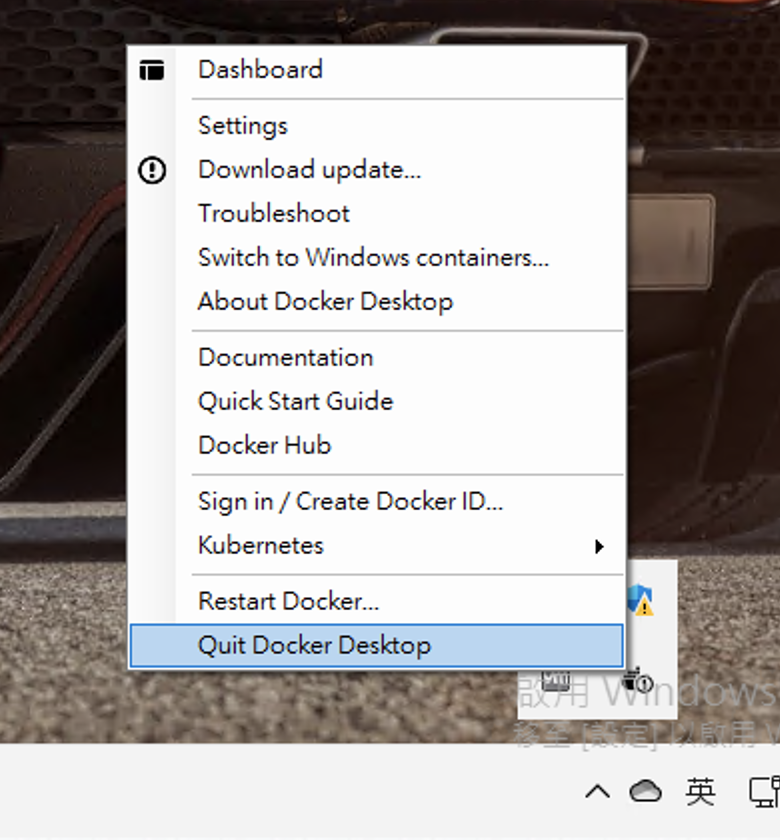

# 關於此文件
如果你在本機 Docker Desktop 因為佔用資源過高影響日常開發，這裡建議在練習時間以外可以暫時停用佔用資源的服務。  

## 停用 Docker Desktop
  
在工作列，點選Quit Docker Desktop

## 停用 Docker Desktop 上的 Kubernetes
  
在 Kubernetes 頁面，取消勾選 Enable Kubernetes

## 清空 Docker Desktop 的 k8s 資料
   
在 Kubernetes 頁面，先啟用 Kubernetes後，點選 Reset Kubernetes Cluster

## 完整清除 Docker Desktop 資料
  
在 Troubleshoot 頁面，先後點選 Clean/Purge Data 和 Reset to factory default
